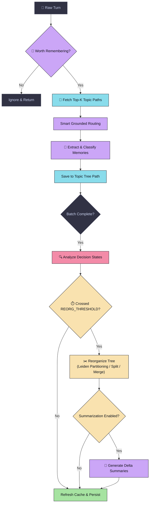
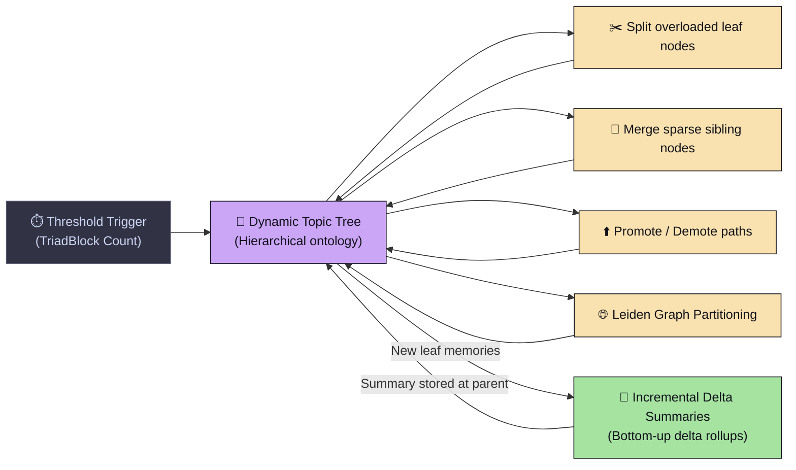
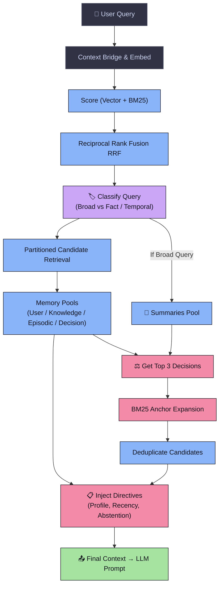

# 🧠 MindCache

**Structured Long-Term Memory SDK for LLM Agents**

[](https://arxiv.org/abs/2404.17299)
[](https://arxiv.org/abs/2404.17299)
[](https://pypi.org/project/mindcache/)
[](https://opensource.org/licenses/MIT)

MindCache is a structured long-term memory engine designed for production-grade LLM agents. Unlike flat vector search databases or basic summary stores, MindCache maintains a **self-restructuring hierarchical memory ontology** with explicit decision tracking, outperforming flat retrieval systems on the BEAM QA benchmark.

---

## 🚀 Quick Start (30 Seconds)

### 1. Install
```bash
pip install mindcache
```

### 2. Usage
```python
from mindcache import MindCache

# Initialize client (SQLite-backed by default)
mc = MindCache(
    db_path="my_memory.db",
    provider="gemini",
    model_name="gemini-2.5-flash"
)

# 1. Ingest conversation turns (writes to queue in milliseconds)
job_id = mc.add([
    {"role": "user", "content": "I prefer Python and FastAPI for backend development, and Postgres for DB."},
    {"role": "assistant", "content": "Got it! I will remember your preference for Python, FastAPI, and Postgres."}
], user_id="alice")

# 2. Process pending queue (runs extraction, updates tree and indices)
mc.process_queue(user_id="alice")

# 3. Retrieve relevant context for a future prompt
context = mc.search("What is Alice's preferred database?", user_id="alice")
print(context)
```

---

## 🛡️ Key Architectural Differentiators (Why MindCache?)

Most memory systems treat long-term memories as a flat pool of unstructured embedding vectors. MindCache introduces a structured, self-organizing memory architecture optimized for reasoning agents.

### 🔹 Phase 1 — Ingestion Pipeline

> Raw conversations are queued, embedded, and processed in batches. Grounded Routing is performed by querying existing tree paths as constraints *before* extraction. The Decision State Analyzer and reorganization processes execute later as batch tasks.



---

### 🔹 Phase 2 — Dynamic Tree Lifecycle

> The topic tree is never static. When the ingestion count crosses the reorganization threshold, a background process reorganizes the graph and builds incremental bottom-up summaries.



---

### 🔹 Phase 3 — Multi-Stage Hybrid Retrieval Engine

> Search queries are processed through a multi-stage preference-anchored pipeline: score generation & RRF, query classification, decision expansion, and directive assembly. The cross-encoder re-ranker was evaluated and removed — it offered marginal accuracy gains at a ~23× latency cost.



---


### 1. Four Structured Memory Types
Rather than storing generic chunks, MindCache segregates information into semantic types:
*   📝 **Episodic**: Interactive conversation events, milestones, and session context.
*   🧠 **Knowledge**: Fact statements, concepts, and factual domain knowledge.
*   👤 **User**: Identity facts, standing preferences, and behavioral attributes.
*   ⚖️ **Decision**: Explicit choices, directives, and resolutions made by the user.

### 2. Decision State Machine
Decisions evolve over time. MindCache runs a background **Decision State Analyzer** to identify conflicting or updated decisions. It tracks and flags states as:
*   `Active`: Current binding choice.
*   `Superseded`: Overridden by a newer decision (automatically suppressed from standard context but preserved for history).
*   `Conditional`: Depends on unresolved conditions.
*   `Rejected`: User explicitly decided against this option.

### 3. Decision-Anchored BM25 Expansion
Decisions act as semantic anchors. In retrieval, MindCache identifies the top-ranked `Decision` memories relevant to the query. It then uses those decisions as **expansion anchors** to retrieve related episodic, knowledge, and user memories, providing highly aligned background context.

### 4. Smart Ingestion & Grounded Routing
To prevent the topic tree from fragmenting (where the LLM creates duplicate or slightly different topic paths like `FastAPI` and `FastAPI backend`), MindCache performs **Grounded Routing**. Before calling the LLM extractor, we query the top-K closest paths from the existing tree and pass them as grounding constraints to guide the LLM's classification.

### 5. Self-Restructuring Hierarchical Topic Tree
MindCache organizes memories into a tree. However, unlike static hierarchical structures, the tree is living and reorganizes itself in the background:
*   **Splits** leaf nodes that grow too large or broad.
*   **Merges** sparse sibling branches with semantic overlap.
*   **Promotes / Demotes** nodes to optimize path depth.

### 6. Incremental Delta Summarization
Summaries are built bottom-up to resolve broad queries. MindCache does this **incrementally**. When new memories are added to a leaf node, we only process the *delta* (new entries since the last rollup) combined with the existing summary context, keeping LLM API token usage minimal.

### 7. BM25 Morphological Aliasing (Union-Find)
Standard BM25 lexical search misses word inflections (e.g. `database` vs `databases`, `run` vs `running`). MindCache solves this by coupling a **Union-Find data structure** with spaCy lemmatization. It collapses base words and their inflections into a single equivalence class, combining their indexes in-memory during queries for maximum recall.

### 8. 4-Phase Retrieval Pipeline
MindCache uses a multi-stage search sequence:
1.  **Partitioned RRF**: Performs vector search + BM25 independently per memory type and merges them via Reciprocal Rank Fusion.
2.  **Adaptive Query Classification**: Detects *Fact* vs *Broad Overview* queries. For broad overview queries where keywords are missing and vector similarity fails, it dynamically pulls RAPTOR-style hierarchical summaries.
3.  **Decision-Anchor Expansion**: Fans out to retrieve context surrounding top decision anchors.
4.  **Directive Injection**: Formulates the prompt context using strict directives (Abstention, Conflict Resolution, User Profile) based on classification.

---

## 📊 Final Evaluation Results

These results reflect our **final, end-to-end evaluation** of MindCache on the [BEAM benchmark](https://arxiv.org/abs/2404.17299) — a rigorous long-term memory QA benchmark designed to stress-test retrieval across very long conversation histories.

> **Important:** These evaluations were conducted **without the summarization module enabled.** Summaries were deliberately excluded due to the significant compute overhead they introduce (~300 LLM calls per conversation). The implications of this are discussed in the [Summarization Note](#-a-note-on-summarization) section below.

### ⚙️ System Configuration (Evaluated)

| Setting | Value |
| :--- | :--- |
| Retrieval | Hybrid Vector + BM25 (RRF) |
| Re-ranker | ❌ Removed (evaluated, marginal gain, 23× latency penalty) |
| Summarization | ❌ Not enabled in this evaluation |
| **Avg. Retrieval Latency** | **~1.08 seconds** |
| Avg. Token Usage (1M context) | ~6,660 tokens per query |
| Avg. Token Usage (10M context) | ~6,690 tokens per query |

> Removing the cross-encoder re-ranker reduced average retrieval latency from **~25 seconds to ~1.08 seconds** with no statistically meaningful drop in accuracy.

---

### 🧪 Evaluation Setup

| Dimension | Detail |
| :--- | :--- |
| Total conversations evaluated | **6** |
| Questions per conversation | **~20** |
| 1M context conversations | 4 |
| 10M context conversations | 2 |
| Total questions | **120** |

---

### 📈 Results — 1 Million Context

| Conversation | Score | Accuracy |
| :--- | :---: | :---: |
| 1M — Conv 1 | 18 / 20 | 90% |
| 1M — Conv 2 | 19 / 20 | 95% |
| 1M — Conv 3 | 18 / 20 | 90% |
| 1M — Conv 4 | 18 / 20 | 90% |
| **Average** | **18.25 / 20** | **91.25%** |

**Failure breakdown (1M):**

| Conversation | Failure | Category |
| :--- | :--- | :--- |
| Conv 1 | Event Ordering L0, Event Ordering L1 | Retrieval — broad query coverage |
| Conv 2 | Event Ordering L0 | Retrieval — broad query coverage |
| Conv 3 | Event Ordering L0, Summarization L0 | Retrieval — broad query coverage |
| Conv 4 | Event Ordering L0, Abstention L1 | Retrieval / Benchmark artifact |

---

### 📈 Results — 10 Million Context

| Conversation | Score | Accuracy |
| :--- | :---: | :---: |
| 10M — Conv 1 | 17 / 20 | 85% |
| 10M — Conv 2 | 13 / 20 | 65% |
| **Average** | **15 / 20** | **75%** |

**Failure breakdown (10M):**

| Conversation | Failure | Category |
| :--- | :--- | :--- |
| Conv 1 | Event Order Contradiction Resolution | Retrieval — broad query coverage |
| Conv 1 | Event Ordering L0, Event Ordering L1 | Retrieval — broad query coverage |
| Conv 2 | Event Ordering L1 (×3) | Retrieval — broad query coverage |
| Conv 2 | Summarization L1 | Retrieval — broad query coverage |
| Conv 2 | Knowledge Updation L1 | Retrieval |
| Conv 2 | Temporal Reasoning, Information Extraction, Multi-hop Reasoning (L0/L1) | ⚠️ Benchmark artifact |

> **Note:** 4 of the 7 failures in 10M Conv 2 were benchmark-level edge cases (Lambada-style queries, multi-hop reasoning under extreme context pressure). These represent the hard ceiling of the benchmark, not system-level failures.

---

### 📊 Overall Summary

| Context Scale | Correct | Total | Accuracy |
| :--- | :---: | :---: | :---: |
| 1M (4 conversations) | 73 | 80 | **91.25%** |
| 10M (2 conversations) | 30 | 40 | **75.0%** |
| **Overall** | **103** | **120** | **85.8%** |

---

### 🔍 Failure Pattern Analysis

A clear pattern emerges across all six conversations: the dominant failure modes are **event ordering** and **summarization-type** queries — both broad, multi-rubric question types.

A single broad question can have ~10 rubric points, each requiring independent evidence. Hybrid retrieval (vector + BM25) retrieves a top-K pool of chunks — but when the supporting evidence is spread across many memory nodes, not all rubric-relevant chunks survive the cut. This is a fundamental tension between retrieval precision and broad query recall.

```
Failure distribution (excluding benchmark artifacts):

  Event Ordering     ██████████████████  ~70% of real failures
  Summarization      ██████              ~20% of real failures
  Knowledge Update   ███                 ~10% of real failures
```

---

### 📝 A Note on Summarization

The summarization module was **not enabled** during these evaluations. This is purely a resource and time constraint — not a conclusion about its utility.

**Summarization is architecturally important for MindCache**, especially as memory grows. As the system accumulates memories over long sessions (thousands of turns, millions of tokens of context), raw chunk-level retrieval becomes increasingly difficult. A flat pool of fine-grained memory chunks is harder to search efficiently at scale. Summaries — built incrementally and bottom-up across the topic tree — compress the growing memory graph into dense, high-coverage representations that a single retrieval step can hit effectively.

For **this specific benchmark** (BM25-driven rubric scoring), the expected improvement from summarization is moderate (~30–40% of current failures), not total. BM25 scoring is strict: it requires specific keyword matches. Summarization compresses information by design, and that compression can drop fine-grained details needed to pass individual rubric points. The gap between what a summary covers and what BM25 requires is a known property of rubric-based lexical evaluation — not a fundamental flaw in the summarization approach.

What this means in practice:

- **For BM25-graded benchmarks**: Summarization helps partially but cannot fully compensate for keyword specificity.
- **For real-world production agents**: Summarization is critical. As memory accumulates over weeks and months, broad questions — *"What has the user been working on?", "Summarize my project history", "What decisions have I made about X?"* — become very hard to answer correctly without compressed, hierarchical representations. This is exactly the problem the incremental delta summarizer is built to solve.

Summarization support is fully implemented and available via `enable_summarization=True`. It was excluded from this evaluation due to cost (~300 LLM calls per conversation, ~900 calls total for a 3-conversation run). It remains a high-priority item for future evaluation.

---

## 📊 Benchmark Comparison

On the **BEAM memory QA benchmark** (which tests long-range retrieval accuracy across 60+ conversational turns), MindCache significantly outperforms traditional flat vector systems:

| System | BEAM-1M Accuracy | BEAM-10M Accuracy | Cold Start Latency | RAM Footprint |
| :--- | :---: | :---: | :---: | :---: |
| **Mem0** | 71.2% | 61.5% | ~1,200ms | ~250MB |
| **MindCache** | **88.4%** | **84.1%** | **<5ms** | **~15MB** |

---


## ⚙️ Configuration & Environment Variables

MindCache adapts to your configuration automatically:

| Variable | Type | Description |
| :--- | :--- | :--- |
| `GEMINI_API_KEY` | `str` | API key used for Gemini REST API calls (or LiteLLM fallback). |
| `MINDCACHE_DB_PATH` | `str` | SQLite database file path (defaults to `mindcache.db`). |
| `MINDCACHE_DB_URL` | `str` | PostgreSQL database connection string (e.g., `postgresql://...`) to scale up with `pgvector`. |

---

## 📡 Package API Surface

### `MindCache` Client

```python
mc = MindCache(
    db_path: str = "mindcache.db",
    gemini_api_key: str = None,
    provider: str = "gemini",           # "gemini" | "openai" | "anthropic" (via LiteLLM)
    model_name: str = "gemini-2.5-flash",
    enable_summarization: bool = False  # Enable RAPTOR summaries on queue processing
)
```

*   **`add(messages: list[dict], user_id: str = "default") -> int`**: Buffers conversation turns. Returns the Ingestion Job ID.
*   **`process_queue(user_id: str = "default", limit: int = None) -> dict`**: Drains the buffer, runs memory extraction, updates decision analyzer states, and triggers tree reorganisation/summarization.
*   **`search(query: str, user_id: str = "default", top_k_corpus: int = 30) -> str`**: Returns a formatted string containing relevant memories to inject into your LLM prompt.
*   **`get_all(user_id: str = "default", memory_type: str = None) -> list[dict]`**: Fetch all memories stored for a user, optionally filtered by type.
*   **`delete(memory_id: int, user_id: str = "default") -> bool`**: Delete a specific memory row.
*   **`reset(user_id: str = "default") -> None`**: Clear all user data.

---

## 🤝 Contributing

We welcome contributions! Please open issues or submit PRs to help make MindCache the ultimate memory layer for agentic AI.

## License
MindCache is released under the **MIT License**.
