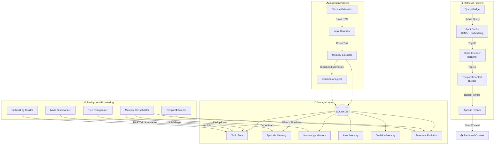

# 🧠 MindCache

**A Hierarchical Long-Term Memory System for LLMs**

MindCache captures your AI conversations, extracts structured memories, organizes them into a dynamic topic tree, and retrieves relevant context for future conversations — giving your LLM a persistent, evolving understanding of who you are and what you've discussed.

> _"What if your AI assistant could actually remember what you talked about last week?"_

---

## ✨ Key Features

- **Hierarchical Topic Tree** — Memories are organized in a self-restructuring tree, not a flat vector store. Topics that grow too large are automatically split by an LLM.
- **4 Memory Types** — Episodic (what happened), Knowledge (facts learned), User (behavioral patterns), and Decision (choices with status tracking).
- **RAPTOR-Style Summarization** — Recursive bottom-up summaries create multi-resolution abstractions at every level of the tree.
- **2-Stage Retrieval Pipeline** — BM25 + embedding hybrid search → Cross-encoder reranking. Top-30 candidates filtered to the best 10.
- **Temporal Evolution Tracking** — Chronological timelines show how topics evolved over multiple sessions, with budget-aware context inclusion.
- **Batched LLM Operations** — Memory consolidation, deduplication, and temporal indexing are batched to minimize API costs.
- **Chrome Extension** — Automatically captures conversations from AI chat platforms and sends them for processing.
- **Visual Explorer** — Web-based tree visualization and graph explorer for inspecting your memory graph.

---

## 🏗️ Architecture



---

## 📁 Project Structure

```
MindCache/
├── api_server.py                 # FastAPI server — ingest, retrieve, tree, scheduler
├── requirements.txt              # Python dependencies
│
├── Memory_extract/               # Ingestion pipeline
│   ├── input_denoiser.py         # HTML → clean conversation text
│   ├── memory_extractor.py       # LLM-based structured memory extraction
│   ├── schema.py                 # Pydantic schemas (ChatExtraction, MemoryData)
│   ├── safe_ai.py                # Rate-limited Gemini wrapper with key rotation
│   └── build_data.py             # Batch data preparation
│
├── Database/                     # Storage & background processing
│   ├── db_setup.py               # SQLAlchemy models (Topic, 4 memory types, etc.)
│   ├── db_manager.py             # Core DB operations, topic assignment
│   ├── reorganize_tree.py        # LLM-driven tree restructuring (split/merge)
│   ├── nodes_summary.py          # RAPTOR-style recursive summarization
│   ├── memory_consolidator.py    # Batched deduplication + temporal evolution
│   ├── temporal_batcher.py       # Batch temporal timeline builder (gap filler)
│   ├── embedder.py               # Embedding generation manager
│   ├── decision_analyzer.py      # Decision state tracking and enrichment
│   └── background_scheduler.py   # Pipeline orchestrator
│
├── retrieval/                    # Retrieval pipeline
│   ├── active_path.py            # Main retrieval: ActivePathRetrieval
│   ├── root_cache.py             # CollapsedTreeCache (BM25 + embedding hybrid)
│   ├── hybrid_search.py          # Cross-encoder reranking + RRF fusion
│   ├── context_bridge.py         # Query processing, embedding, drift detection
│   ├── agentic_refiner.py        # Generates retrieval hints for answer LLM
│   └── structs.py                # RetrievalConfig, RetrievalResult dataclasses
│
├── eval/                         # Evaluation & analysis tools
│   ├── eval_beam_qa.py           # BEAM benchmark evaluation
│   ├── eval_retrieval.py         # Retrieval quality metrics
│   ├── eval_manual_check.py      # Manual verification framework
│   ├── ingest_api.py             # Batch ingestion for evaluation
│   └── ...                       # Various analysis and debugging scripts
│
├── BEAM/                         # BEAM benchmark dataset
│   └── eval_data_beam.json       # Evaluation questions and ground truth
│
└── static/                       # Web UI (tree explorer, graph viewer)
```

---

## 🚀 Setup

### Prerequisites

- Python 3.10+
- A Google API key (Gemini) for LLM operations
- ~2GB disk space for embedding models (downloaded on first run)

### Installation

```bash
# Clone the repository
git clone https://github.com/yourusername/MindCache.git
cd MindCache

# Create virtual environment
python -m venv venv
venv\Scripts\activate        # Windows
# source venv/bin/activate   # macOS/Linux

# Install dependencies
pip install -r requirements.txt

# Additional dependencies for the API server
pip install fastapi uvicorn
```

### Configuration

Set your Google API key as an environment variable:

```bash
# Windows
set GOOGLE_API_KEY=your_api_key_here

# macOS/Linux
export GOOGLE_API_KEY=your_api_key_here
```

### Running

```bash
# Start the API server
python api_server.py

# The server runs at http://127.0.0.1:8000
# Web UI available at http://127.0.0.1:8000/ (tree view)
# Graph explorer at http://127.0.0.1:8000/graph
```

---

## 📡 API Reference

| Method | Endpoint | Description |
|--------|----------|-------------|
| `GET` | `/health` | Health check |
| `POST` | `/ingest` | Add a prompt/response pair to the processing queue |
| `POST` | `/retrieve` | Run the full retrieval pipeline for a query |
| `GET` | `/tree?depth=3` | Get the topic hierarchy |
| `GET` | `/node/{id}/memories` | Get all memories for a specific topic node |
| `GET` | `/node/{id}/tree` | Get a subtree rooted at a specific node |
| `GET` | `/topic-suggestions?q=...` | Get semantically relevant topic suggestions |
| `GET` | `/queue/status` | Check the processing queue status |
| `POST` | `/run-scheduler` | Trigger the full background pipeline |
| `POST` | `/run-tier1` | Run extraction + decision analysis only |
| `POST` | `/run-tier2` | Run full pipeline (reorg + summaries + embeddings) |
| `GET` | `/scheduler-status` | Check if the background scheduler is running |

### Example: Retrieve Context

```bash
curl -X POST http://127.0.0.1:8000/retrieve \
  -H "Content-Type: application/json" \
  -d '{"query": "What do I know about modular arithmetic?"}'
```

### Example: Ingest a Conversation

```bash
curl -X POST http://127.0.0.1:8000/ingest \
  -H "Content-Type: application/json" \
  -d '{
    "prompt": "Explain the Chinese Remainder Theorem",
    "response": "The CRT states that if the moduli are pairwise coprime..."
  }'
```

---

## 🔬 Technical Deep Dive

### Memory Extraction

Each conversation is processed through a structured extraction schema that produces four memory types:

| Type | Purpose | Example |
|------|---------|---------|
| **Episodic** | What happened during the conversation | "Struggled with understanding why gcd(a,m)=1 is required for modular inverse" |
| **Knowledge** | Domain-specific facts learned | "CRT requires pairwise coprime moduli; solution is unique modulo M=m₁·m₂·...·mₖ" |
| **User** | Behavioral patterns and preferences | "Approaches new math concepts by working through small concrete examples first" |
| **Decision** | Choices made with context tracking | "Chose to implement RSA with 2048-bit keys for the cryptography project" |

### Dynamic Tree Reorganization

The topic tree self-organizes as memories accumulate. When a leaf node exceeds a threshold, the `reorganize_tree.py` module uses an LLM to intelligently split it into more specific subtopics, preserving the hierarchical structure. Similarly, sparse sibling nodes can be merged.

### RAPTOR-Style Summarization

Inspired by the [RAPTOR paper](https://arxiv.org/abs/2401.18059), MindCache builds recursive summaries bottom-up through the tree. Each leaf gets a summary of its memories, each branch gets a summary of its children's summaries, creating multi-resolution abstractions that enable both precise and broad retrieval.

### 2-Stage Retrieval

1. **Stage 1 — Hybrid Search**: BM25 keyword matching and embedding cosine similarity are fused using Reciprocal Rank Fusion (RRF) to produce 30 candidates.
2. **Stage 2 — Cross-Encoder Reranking**: A cross-encoder model scores each candidate against the query for precise semantic matching, selecting the final top 10.

### Budget-Aware Temporal Context

Temporal evolution timelines are appended to retrieved context with intelligent filtering:
- **Single-date timelines are skipped** — no evolution means the timestamp on each memory is sufficient.
- **Multi-date timelines are included** — showing how topics developed across sessions.
- **Hard budget cap of 2,500 tokens** — prevents temporal context from overwhelming the retrieval output.

### Batched LLM Optimization

Instead of making one LLM call per topic (which would be 150+ API calls), memory consolidation and temporal indexing are batched:
- Multiple small topics are packed into a single prompt under an 8,000-token limit
- Large topics get their own dedicated call
- This reduces API costs by **60-80%** compared to per-topic processing

---

## 🧪 Evaluation

MindCache includes a comprehensive evaluation framework built around the [BEAM benchmark](https://arxiv.org/abs/2404.17299):

```bash
# Run BEAM evaluation
python -m eval.eval_beam_qa

# Run retrieval quality metrics
python -m eval.eval_retrieval

# Manual verification
python -m eval.eval_manual_check
```

---

## 🛠️ Background Pipeline

The full processing pipeline runs in this order:

1. **Memory Extraction** — Parse queued conversations into structured memories
2. **Tree Reorganization** — Split/merge nodes as needed
3. **Decision Analysis** — Enrich decision memories with context
4. **Node Summaries** — RAPTOR-style recursive summarization
5. **Embedding Cache** — Generate/update embedding vectors
6. **Cache Pre-warm** — Rebuild retrieval caches

Trigger manually:
```bash
python Database/background_scheduler.py
```

Or via API:
```bash
curl -X POST http://127.0.0.1:8000/run-scheduler
```

---

## 📊 Database Stats (Example)

After processing a series of number theory / cryptography conversations:

| Metric | Count |
|--------|-------|
| Topic nodes (total) | 151 leaf + branches |
| Episodic memories | ~400+ |
| Knowledge memories | ~300+ |
| Total memories | ~1,000+ |
| Temporal timelines | 151 (64 with multi-date evolution) |
| Tree depth | Up to 5 levels |

---

## 🤝 Contributing

This is a research prototype built as a solo project. Contributions, ideas, and feedback are welcome!

---

## 📄 License

MIT License — see [LICENSE](LICENSE) for details.

---

<p align="center">
  Built with curiosity, caffeine, and too many late nights. ☕🌙
</p>
