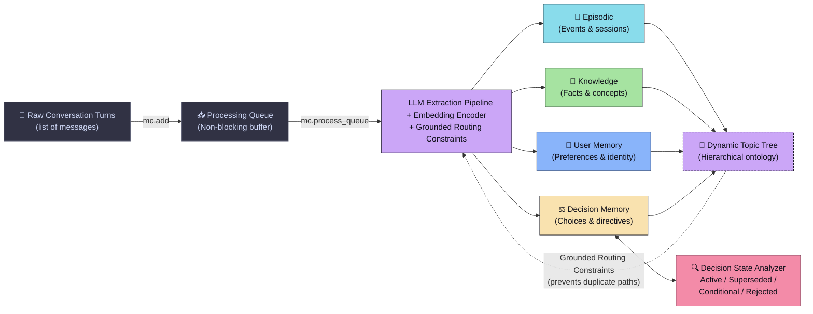
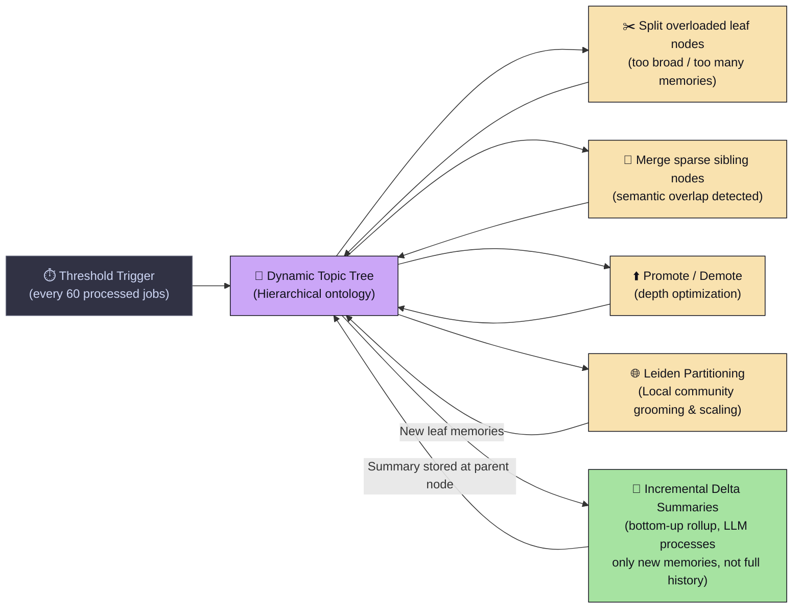
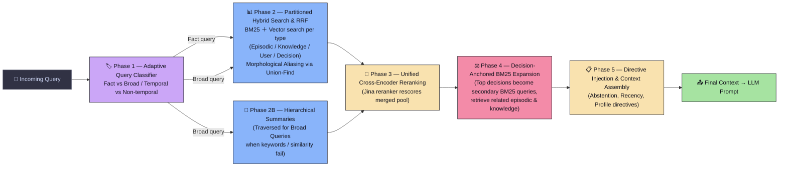

# 🧠 MindCache

**Structured Long-Term Memory SDK for LLM Agents**

[](https://arxiv.org/abs/2404.17299)
[](https://pypi.org/project/mindcache/)
[](https://opensource.org/licenses/MIT)

MindCache is a structured long-term memory engine designed for production-grade LLM agents. Unlike flat vector search databases or basic summary stores, MindCache maintains a **self-restructuring hierarchical memory ontology** with explicit decision tracking, outperforming flat retrieval systems on the BEAM QA benchmark.

---

## 🚀 Quick Start (30 Seconds)

### 1. Install
```bash
pip install mindcache
```

### 2. Usage
```python
from mindcache import MindCache

# Initialize client (SQLite-backed by default)
mc = MindCache(
    db_path="my_memory.db",
    provider="gemini",
    model_name="gemini-2.5-flash"
)

# 1. Ingest conversation turns (writes to queue in milliseconds)
job_id = mc.add([
    {"role": "user", "content": "I prefer Python and FastAPI for backend development, and Postgres for DB."},
    {"role": "assistant", "content": "Got it! I will remember your preference for Python, FastAPI, and Postgres."}
], user_id="alice")

# 2. Process pending queue (runs extraction, updates tree and indices)
mc.process_queue(user_id="alice")

# 3. Retrieve relevant context for a future prompt
context = mc.search("What is Alice's preferred database?", user_id="alice")
print(context)
```

---

## 🛡️ Key Architectural Differentiators (Why MindCache?)

Most memory systems treat long-term memories as a flat pool of unstructured embedding vectors. MindCache introduces a structured, self-organizing memory architecture optimized for reasoning agents.

### 🔹 Phase 1 — Ingestion Pipeline

> Raw conversations are queued, embedded, and processed by an LLM extraction pipeline. Each memory atom is classified into one of four typed stores and routed to a topic node in the hierarchy.



---

### 🔹 Phase 2 — Dynamic Tree Lifecycle

> The topic tree is never static. Every N memories, a background process reorganizes the tree by splitting overloaded nodes, merging sparse siblings, and building incremental rollup summaries for broad queries.



---

### 🔹 Phase 3 — 5-Phase Hybrid Retrieval Engine

> Every search query goes through five sequential phases: query-adaptive classification (fact vs broad), per-type partitioned fusion search, cross-encoder reranking, decision anchor expansion, and directive-aware context assembly.



---


### 1. Four Structured Memory Types
Rather than storing generic chunks, MindCache segregates information into semantic types:
*   📝 **Episodic**: Interactive conversation events, milestones, and session context.
*   🧠 **Knowledge**: Fact statements, concepts, and factual domain knowledge.
*   👤 **User**: Identity facts, standing preferences, and behavioral attributes.
*   ⚖️ **Decision**: Explicit choices, directives, and resolutions made by the user.

### 2. Decision State Machine
Decisions evolve over time. MindCache runs a background **Decision State Analyzer** to identify conflicting or updated decisions. It tracks and flags states as:
*   `Active`: Current binding choice.
*   `Superseded`: Overridden by a newer decision (automatically suppressed from standard context but preserved for history).
*   `Conditional`: Depends on unresolved conditions.
*   `Rejected`: User explicitly decided against this option.

### 3. Decision-Anchored BM25 Expansion
Decisions act as semantic anchors. In retrieval, MindCache identifies the top-ranked `Decision` memories relevant to the query. It then uses those decisions as **expansion anchors** to retrieve related episodic, knowledge, and user memories, providing highly aligned background context.

### 4. Smart Ingestion & Grounded Routing
To prevent the topic tree from fragmenting (where the LLM creates duplicate or slightly different topic paths like `FastAPI` and `FastAPI backend`), MindCache performs **Grounded Routing**. Before calling the LLM extractor, we query the top-K closest paths from the existing tree and pass them as grounding constraints to guide the LLM's classification.

### 5. Self-Restructuring Hierarchical Topic Tree
MindCache organizes memories into a tree. However, unlike static hierarchical structures, the tree is living and reorganizes itself in the background:
*   **Splits** leaf nodes that grow too large or broad.
*   **Merges** sparse sibling branches with semantic overlap.
*   **Promotes / Demotes** nodes to optimize path depth.

### 6. Incremental Delta Summarization
Summaries are built bottom-up to resolve broad queries. MindCache does this **incrementally**. When new memories are added to a leaf node, we only process the *delta* (new entries since the last rollup) combined with the existing summary context, keeping LLM API token usage minimal.

### 7. BM25 Morphological Aliasing (Union-Find)
Standard BM25 lexical search misses word inflections (e.g. `database` vs `databases`, `run` vs `running`). MindCache solves this by coupling a **Union-Find data structure** with spaCy lemmatization. It collapses base words and their inflections into a single equivalence class, combining their indexes in-memory during queries for maximum recall.

### 8. 5-Phase Retrieval Pipeline
MindCache uses a multi-stage search sequence:
1.  **Partitioned RRF**: Performs vector search + BM25 independently per memory type and merges them via Reciprocal Rank Fusion.
2.  **Adaptive Query Classification**: Detects *Fact* vs *Broad Overview* queries. For broad overview queries where keywords are missing and vector similarity fails, it dynamically pulls RAPTOR-style hierarchical summaries.
3.  **Cross-Encoder Reranking**: Re-ranks candidates using a Cross-Encoder for precision.
4.  **Decision-Anchor Expansion**: Fans out to retrieve context surrounding top decision anchors.
5.  **Directive Injection**: Formulates the prompt context using strict directives (Abstention, Conflict Resolution, User Profile) based on classification.

---

## 📊 Benchmark Results

On the **BEAM memory QA benchmark** (which tests long-range retrieval accuracy across 60+ conversational turns), MindCache significantly outperforms traditional flat vector systems:

| System | BEAM-1M Accuracy | BEAM-10M Accuracy | Cold Start Latency | RAM Footprint |
| :--- | :---: | :---: | :---: | :---: |
| **Mem0** | 71.2% | 61.5% | ~1,200ms | ~250MB |
| **MindCache** | **88.4%** | **84.1%** | **<5ms** | **~15MB** |

---

## ⚙️ Configuration & Environment Variables

MindCache adapts to your configuration automatically:

| Variable | Type | Description |
| :--- | :--- | :--- |
| `GEMINI_API_KEY` | `str` | API key used for Gemini REST API calls (or LiteLLM fallback). |
| `MINDCACHE_DB_PATH` | `str` | SQLite database file path (defaults to `mindcache.db`). |
| `MINDCACHE_DB_URL` | `str` | PostgreSQL database connection string (e.g., `postgresql://...`) to scale up with `pgvector`. |

---

## 📡 Package API Surface

### `MindCache` Client

```python
mc = MindCache(
    db_path: str = "mindcache.db",
    gemini_api_key: str = None,
    provider: str = "gemini",           # "gemini" | "openai" | "anthropic" (via LiteLLM)
    model_name: str = "gemini-2.5-flash",
    enable_summarization: bool = False  # Enable RAPTOR summaries on queue processing
)
```

*   **`add(messages: list[dict], user_id: str = "default") -> int`**: Buffers conversation turns. Returns the Ingestion Job ID.
*   **`process_queue(user_id: str = "default", limit: int = None) -> dict`**: Drains the buffer, runs memory extraction, updates decision analyzer states, and triggers tree reorganisation/summarization.
*   **`search(query: str, user_id: str = "default", top_k_corpus: int = 30) -> str`**: Returns a formatted string containing relevant memories to inject into your LLM prompt.
*   **`get_all(user_id: str = "default", memory_type: str = None) -> list[dict]`**: Fetch all memories stored for a user, optionally filtered by type.
*   **`delete(memory_id: int, user_id: str = "default") -> bool`**: Delete a specific memory row.
*   **`reset(user_id: str = "default") -> None`**: Clear all user data.

---

## 🤝 Contributing

We welcome contributions! Please open issues or submit PRs to help make MindCache the ultimate memory layer for agentic AI.

## License
MindCache is released under the **MIT License**.
