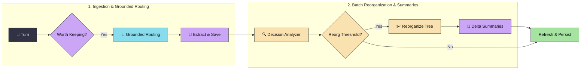
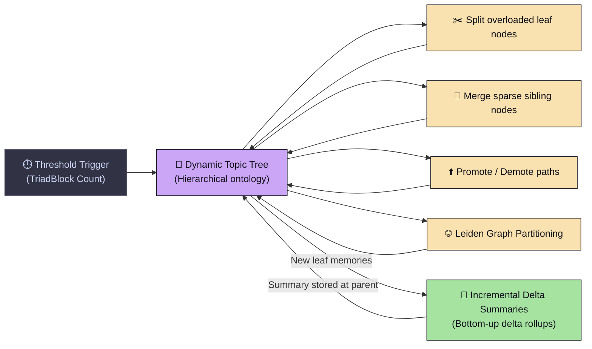

# 🧠 MindCache

**An open-source long-term memory engine for LLM agents.**

Instead of storing conversations as a flat collection of embedding vectors, MindCache organizes them into a living knowledge hierarchy with specialized memory types, evolving decision tracking, and incremental summaries. It is built for assistants that need to reason across weeks or months of conversations rather than retrieve isolated facts.

[](https://arxiv.org/abs/2404.17299)
[](https://arxiv.org/abs/2404.17299)
[](https://pypi.org/project/mindcache/)
[](https://opensource.org/licenses/MIT)
[](https://medium.com/@faisaliitian/building-mindcache-designing-an-agentic-memory-system-for-long-term-ai-7359e0cf6e2a?sharedUserId=faisaliitian)
[](https://www.youtube.com/watch?v=wcTQkyN1CoM)

---

👉 **[Read the Design Article](https://medium.com/@faisaliitian/building-mindcache-designing-an-agentic-memory-system-for-long-term-ai-7359e0cf6e2a?sharedUserId=faisaliitian)** &nbsp;|&nbsp; 🎥 **[Watch Demo Video](https://www.youtube.com/watch?v=wcTQkyN1CoM)** &nbsp;|&nbsp; ⚡ **[Quick Start](#-quick-start-30-seconds)**

---

## 📹 Demo

A 2-minute walkthrough covering installation, ingestion, automatic hierarchy generation, and hybrid retrieval.

[](https://www.youtube.com/watch?v=wcTQkyN1CoM)
> 🎥 **[Watch the MindCache Walkthrough & Demo on YouTube](https://www.youtube.com/watch?v=wcTQkyN1CoM)**

---

## 🚀 Quick Start (30 Seconds)

### 1. Install
```bash
pip install mindcache
```

### 2. Usage
```python
from mindcache import MindCache

# Initialize client (SQLite-backed by default)
mc = MindCache(
    db_path="my_memory.db",
    provider="gemini",
    model_name="gemini-2.5-flash"
)

# 1. Ingest conversation turns (buffered into processing queue)
job_id = mc.add([
    {"role": "user", "content": "I prefer Python and FastAPI for backend development, and Postgres for DB."},
    {"role": "assistant", "content": "Got it! I will remember your preference for Python, FastAPI, and Postgres."}
], user_id="alice")

# 2. Process pending queue (extracts memories, updates tree and indices)
mc.process_queue(user_id="alice")

# 3. Retrieve structured context for future prompts
context = mc.search("What is Alice's preferred database?", user_id="alice")
print(context)
```

---

## 💡 Why MindCache?

Most long-term memory systems treat past interactions as a flat pool of unstructured embedding vectors. Over weeks of interaction, flat retrieval suffers from **context inflation**, **temporal collapse** (treating old choices as equal to current decisions), and **broad-query failure** (unable to answer high-level questions like *"What projects have I worked on this month?"*).

MindCache shifts from **flat search** to a **living hierarchical memory tree**:

- **Problem**: Flat vector stores return disconnected snippets without temporal or structural context.
- **Insight**: Long-term memory requires distinct memory types, explicit decision lifecycle tracking, and hierarchical summaries.
- **Design**: MindCache continuously organizes incoming information into a dynamic topic tree, tracks evolving decisions, and rolls up delta summaries.
- **Evidence**: Evaluated on 300 benchmark questions across 1M and 10M token context windows, MindCache achieved the best overall performance among the memory systems evaluated in our BEAM experiments.

### System Pipeline

```
Conversation Turns
      │
      ▼
Memory Extraction
      │
      ▼
Four Memory Types (User / Decision / Episodic / Knowledge)
      │
      ▼
Living Hierarchical Topic Tree
      │
      ▼
Incremental Delta Summaries
      │
      ▼
Hybrid RRF Search (Vector + BM25)
      │
      ▼
Decision-Anchor BM25 Expansion
      │
      ▼
Final Assembled Context → LLM Prompt
```

### 🌿 Automatically Organized Topic Hierarchy

As conversations are ingested, MindCache continuously organizes extracted memories into a hierarchical topic tree. Rather than storing memories as a flat collection of embeddings, related concepts are grouped into increasingly specific topics. Leaf nodes contain memory clusters (e.g. `[memories: 47]`), while internal nodes provide semantic organization for retrieval and summarization.

<p align="center">
  
</p>


> *This hierarchy is maintained incrementally as new conversations arrive and serves as the structural backbone for both hierarchical summarization and hybrid retrieval.*

---

## ✨ Highlights

- 🌲 **Living Hierarchical Topic Tree**: Organizes raw turns into dynamic knowledge trees rather than flat vector pools.
- 🧩 **Four Specialized Memory Types**: Dedicated handling for User, Decision, Episodic, and Knowledge memories.
- 🎯 **Decision State Tracking**: Tracks evolving choices so past decisions don't overwrite current preferences.
- 🔍 **Hybrid RRF Retrieval**: Merges dense semantic vector search with sparse BM25 lexical matching via Reciprocal Rank Fusion.
- 📚 **Incremental Hierarchical Summaries**: Bottom-up RAPTOR-style summaries for broad-topic and multi-session reasoning.
- ⚡ **1.08s Average Retrieval Latency**: Production-ready, low-latency execution.
- 📊 **Evaluated on BEAM QA**: Tested across 300 questions on 1M and 10M token context windows.

---

## 📊 Evaluation

MindCache was evaluated on the **BEAM QA Benchmark**—a long-term memory benchmark designed to evaluate retrieval across multi-session conversation histories at 1M and 10M token context windows (300 manually graded questions across 15 conversations).

### Benchmark Overview

| Metric | Result |
| :--- | ---: |
| Benchmark | BEAM QA |
| Questions | 300 |
| Conversations | 15 |
| Context Windows | 1M / 10M |
| Avg. Retrieval Latency | **1.08 s** |
| Overall Performance | **Best among evaluated systems** |

### System Comparison

| System | BEAM Benchmark Summary | Representative Follow-up Evaluation | Memory & Retrieval Architecture |
| :--- | :--- | :--- | :--- |
| **MindCache** | 🥇 **Best overall performance*** | Outperformed Mem0 across all manually analyzed conversations | Living topic hierarchy, decision tracking & incremental summaries |
| **Mem0** | 🥈 **Competitive baseline** | Lower rubric scores and fewer passing answers across runs | Flat Memory Store |

*\* Based on our evaluation of the BEAM benchmark (300 questions across 15 conversations). Full methodology and category breakdowns are described in the accompanying [design article](https://medium.com/@faisaliitian/building-mindcache-designing-an-agentic-memory-system-for-long-term-ai-7359e0cf6e2a?sharedUserId=faisaliitian).*

### Representative Follow-up Evaluation

To better understand the impact of the final architectural refinements, we manually evaluated representative BEAM conversations after completing the final retrieval architecture (hierarchical summaries, decision-anchor retrieval, retrieval budgeting, and hierarchical path indexing).

Each conversation was evaluated using **two complementary metrics**:

- **Strict Pass Rate** — A question was counted as a pass only if **all required rubric items were satisfied**. A strong answer missing a single required item was counted as a failure.
- **Rubric Coverage** — The percentage of all rubric items satisfied across the evaluation. This captures partial correctness even when a question does not meet the strict pass threshold.

| Conversation | Mem0 | MindCache | Improvement |
| :--- | :--- | :--- | :--- |
| **Conversation 1** | 45% pass (9/20) · 49.1% rubric coverage | **60% pass (12/20) · 69.545% rubric coverage** | +15 pp pass rate · +20.4 pp rubric coverage |
| **Conversation 2** | 45% pass (9/20) · 50.2% rubric coverage | **65% pass (13/20) · 61.2% rubric coverage** | +20 pp pass rate · +11.0 pp rubric coverage |

> **Observation:** Across both evaluated conversations, MindCache consistently outperformed Mem0 on both strict pass rate and rubric coverage. Conversation 1 reached a 60% pass rate (12/20) with 69.5% rubric coverage, while Conversation 2 achieved a 65% pass rate (13/20) with 61.2% rubric coverage, demonstrating MindCache's superior retrieval and structured contextual reasoning.


### Performance by Task Category

- **Instruction Following** (`Advantage: MindCache`): MindCache achieved a perfect score (**1.000 vs. 0.500**), adhering strictly to context directives and retrieval constraints.
- **Summarization** (`Advantage: MindCache`): MindCache significantly outperformed Mem0 (**0.750 vs. 0.455**), leveraging bottom-up hierarchical summaries for broad queries.
- **Contradiction Resolution** (`Advantage: MindCache`): MindCache effectively resolved evolving choices and updated facts (**0.562 vs. 0.375**).
- **Multi-Session Reasoning** (`Advantage: MindCache`): MindCache excelled at connecting evidence across separate session histories (**0.917 vs. 0.833**).
- **Knowledge Update** (`Advantage: MindCache`): MindCache effectively managed memory updating and fact evolution over multi-turn interactions (**0.500 vs. 0.500**).
- **Information Extraction** (`Mem0 ≈ MindCache`): Mem0 and MindCache performed comparably (**0.450 vs. 0.400**), with MindCache remaining conservative to refrain from hallucinating specifics when retrieval context is ambiguous.
- **Temporal Reasoning** (`Mem0 ≈ MindCache`): Both systems performed equally well on reconstructing multi-month timelines and event sequences (**0.875 vs. 0.875**).
- **Preference Following** (`Advantage: Mem0`): Mem0 maintained a slight edge (**0.835 vs. 0.790**) in retrieving direct user preference statements.

---

### Strengths & Remaining Failure Modes

#### Key Strengths
- **Multi-session synthesis**: Seamlessly bridges facts across months of conversation history.
- **Chronological tracking**: Accurately tracks sequence of events and evolving preferences.
- **Broad topic coverage**: Hierarchical summaries answer high-level overview questions effectively.

#### Remaining Failure Modes
- **Summary compression**: Incremental summaries occasionally omit fine-grained named entities or specific numeric values.
- **Ambiguity resolution**: Cautious retrieval logic sometimes opts for uncertainty/abstention when multiple candidate memories overlap, costing points on strict exact-match benchmarks.
- **Fine-grained evidence loss**: Compressing long subtrees into high-level summaries can occasionally drop specific minor details required by exact-match test rubrics.

---

## 🧠 Design Insights

During the development and evaluation of MindCache, we experimented with multiple memory organization and retrieval strategies. **Five architectural decisions consistently emerged as valuable during development and were retained in the final system. One of these (hierarchical summaries) was quantitatively evaluated, while the remaining decisions are supported by repeated manual inspection and iterative testing.**

### 1. Specialized Memory Types
Separating memories into four semantic categories—**User**, **Decision**, **Episodic**, and **Knowledge**—became a core design decision after iterative experimentation, enabling specialized update lifecycles and more balanced retrieval.

### 2. Retrieval Budgeting Per Memory Type
Rather than filling the context window with the globally highest-scoring memories (which often results in a single memory category dominating), MindCache allocates explicit retrieval quotas across memory types. This guarantees evidence diversity in every prompt.

### 3. Dynamic Hierarchical Tree & Incremental Summaries
Incremental RAPTOR-style hierarchical summaries improved retrieval for broad multi-topic queries where semantic vector search alone often struggled. 
> **Evaluation Finding**: Across our follow-up evaluation runs, hierarchical summaries typically activated on 4–6 broad queries per conversation and consistently improved retrieval quality, including multiple failure-to-pass conversions.

### 4. Decision-Guided Retrieval (Decision Anchors)
Top-ranked Decision memories act as semantic anchors. MindCache extracts key concepts from active decisions and performs BM25 lexical expansion to pull in supporting Episodic and Knowledge memories that standard vector search can miss—especially when the user prompt contains few discriminative keywords.

### 5. Hierarchical Path Indexing
Stored memories index their complete tree path (e.g., `Artificial Intelligence → Machine Learning → Deep Learning → PyTorch`). This provides additional lexical context that can improve BM25 recall for broader conceptual queries.

### Architectural Findings Evidence

| Finding | Evaluation Evidence | Evidence Level |
| :--- | :--- | :--- |
| **Hierarchical summaries** | Typically 4–6 activations per conversation; consistently improved retrieval quality | 📊 **Quantitatively Supported** |
| **Decision anchors** | Manual retrieval analysis across development | 🔍 **Observed in Development** |
| **Hierarchical path indexing** | Manual inspection of retrieved evidence across representative queries | 🔍 **Observed in Development** |
| **Four memory types** | Architectural schema refinement | 🏗️ **Design Rationale** |
| **Memory type quotas** | Iterative architectural refinement | 🏗️ **Design Rationale** |

---

## 🖼️ Visual Overview & Screenshots

Below are illustrations of how MindCache structures, updates, and retrieves memories across sessions.

### 1. Decision State Tracking
Tracks decision evolution, marking superseded choices to prevent outdated preferences from leaking.
```
Decision: Use PyTorch for deep learning
Status:   ACTIVE

History:
  TensorFlow (2024-01-10) -> REJECTED
       ↓
  PyTorch Experiment (2024-02-15) -> CONDITIONAL
       ↓
  PyTorch Selection (2024-03-01) -> ACTIVE
```
> *Decisions evolve over time rather than persisting as conflicting memories.*

---

### 2. Context Assembled for LLM
Final prompt context generated by MindCache, featuring memory type partitioning and decision anchors.
```
[USER MEMORY]
• Prefers Python, FastAPI, and Postgres for backend development.

[DECISION MEMORY (ACTIVE)]
• Switched from TensorFlow to PyTorch for model training.

[KNOWLEDGE MEMORY]
• Completed CS50 AI course; familiar with transformer architectures.

[HIERARCHICAL SUMMARY]
• Machine Learning Journey: Transitioned from TF to PyTorch, built MindCache core.
```
> *Structured context assembled for the LLM prompt.*

---

### 3. Incremental Summary Lifecycle
Rolls up node summaries from leaf memories bottom-up to support broad overview queries.
```
Leaf Memories Added (Session 1..N)
             ↓
    Delta Processing (Only new items)
             ↓
Parent Node Summary Updated (Incremental Rollup)
             ↓
Available for High-Level Summarization Queries
```
> *Hierarchical summaries support broad, multi-session overview queries.*

---

## 📦 Core Features

### 🗂️ Memory Organization
- **Living Hierarchical Topic Tree**: Dynamically builds topic nodes to organize memories logically.
- **Dynamic Graph Restructuring**: Performs Leiden graph partitioning, leaf node splitting, and sibling merging as memory grows.
- **Incremental Delta Summaries**: Generates bottom-up summaries processing only new leaf entries (deltas) to save LLM tokens.

### 👤 Memory Modeling
- **Four Specialized Memory Types**: Segmented into *User*, *Decision*, *Episodic*, and *Knowledge* buckets.
- **Decision State Machine**: Automatically detects and manages decision states (`Active`, `Superseded`, `Conditional`, `Rejected`).
- **Grounded Routing**: Queries existing top paths as constraints before extraction to eliminate duplicate topic nodes.

### 🔎 Multi-Stage Retrieval Engine
- **Hybrid Vector + BM25 + RRF**: Parallel dense vector search and sparse lexical search merged via Reciprocal Rank Fusion.
- **Decision-Anchor Expansion**: High-scoring decisions act as expansion anchors to retrieve related episodic and knowledge context.
- **BM25 Morphological Aliasing**: Uses a Union-Find data structure with lemmatization to unify word inflections (`database` / `databases`) in-memory.
- **Adaptive Query Classification**: Dynamically routes between broad overview queries (pulling summaries) and specific factual queries.

---

## ⚙️ Architecture Overview

The MindCache pipeline operates in three distinct phases:

### Phase 1 — Offline Ingestion Pipeline

> *Phase 1 — Offline ingestion pipeline: queueing, grounded routing, extraction, decision analysis, and reorganization trigger.*

---

### Phase 2 — Background Dynamic Tree Lifecycle

> *Phase 2 — Background dynamic tree lifecycle: graph partitioning, node splits/merges, and incremental delta summarization.*

---

### Phase 3 — Online Multi-Stage Hybrid Retrieval Engine

```mermaid
flowchart LR
    classDef dark      fill:#313244,color:#cdd6f4,stroke:#585b70
    classDef llm       fill:#cba6f7,color:#11111b,stroke:#11111b
    classDef search    fill:#89b4fa,color:#11111b,stroke:#11111b
    classDef anchor    fill:#f38ba8,color:#11111b,stroke:#11111b
    classDef green     fill:#a6e3a1,color:#11111b,stroke:#11111b

    subgraph PhaseA ["1. Hybrid RRF Search"]
        Q["🔎 User Query"]:::dark --> S["Vector + BM25"]:::search
        S --> RRF["Reciprocal Rank Fusion"]:::search
    end

    subgraph PhaseB ["2. Memory Pools & Anchors"]
        RRF --> CL["🏷️ Query Classifier"]:::llm
        CL --> P["Memory Pools & Summaries"]:::search
        P --> DA["⚖️ Decision Anchors"]:::anchor
        DA --> EX["BM25 Anchor Expansion"]:::anchor
    end

    subgraph PhaseC ["3. Prompt Assembly"]
        EX --> INJ["📋 Inject Directives"]:::anchor
        INJ --> OUT["📤 Final Context → LLM"]:::green
    end
```

> *Phase 3 — Online multi-stage hybrid retrieval engine: RRF scoring, memory pool partitioning, decision-anchor expansion, and prompt assembly.*

---

## ⚠️ Current Limitations

- **Summary Compression**: Bottom-up node summaries can occasionally compress away fine-grained named entities or specific numeric values.
- **Ambiguity Resolution**: When multiple candidate memories closely match a query, retrieval logic errs on the side of caution/abstention rather than making a guess.

---

## ⚙️ Configuration & Database Setup

MindCache supports SQLite out-of-the-box and PostgreSQL (`pgvector`) for production workloads.

- ⚙️ **SQLite**: Default local setup (`mindcache.db`).
- 🐘 **PostgreSQL**: Set `MINDCACHE_DB_URL="postgresql://..."` or pass to `MindCache(db_path=...)`.

👉 **[View Full Configuration & Setup Guide](docs/configuration.md)**

---

## 📡 API Reference

- **`add(messages, user_id)`**: Buffer conversation turns into the ingestion queue.
- **`process_queue(user_id)`**: Drain queue, extract memories, and update tree summaries.
- **`search(query, user_id)`**: Retrieve formatted context for LLM prompt injection.
- **`get_all()`** / **`delete()`** / **`reset()`**: Manage stored user memories.

👉 **[View Complete API Reference](docs/API.md)**

---

## 🗺️ Roadmap

- [x] **Hierarchical Topic Tree**: Dynamic graph organization.
- [x] **Decision State Machine**: Evolving choice tracking.
- [x] **Incremental Delta Summaries**: Bottom-up rollup summaries.
- [ ] **Utility-Aware Memories**: Access-pattern importance scoring.
- [ ] **Automatic Memory Aging**: Time-decay scoring for episodic memories.
- [ ] **Multi-Agent Shared Memory**: Capability-based shared memory partitions.

---

## 🤝 Contributing

We welcome contributions! Please open an issue or submit a pull request on GitHub to help advance structured long-term memory for AI agents.

## 📄 License

MindCache is open-source software licensed under the **[MIT License](LICENSE)**.
