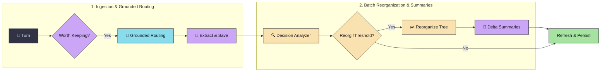
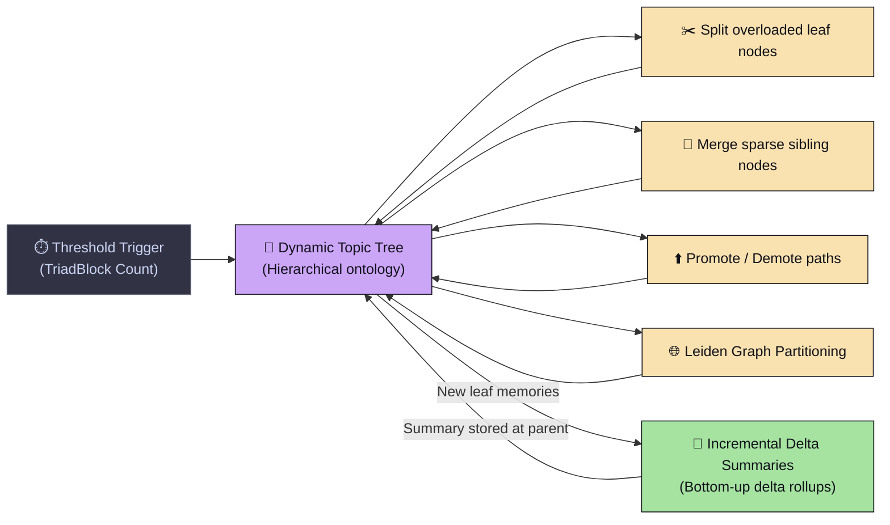

# ⚙️ MindCache Architecture Overview

MindCache is structured around a 3-phase architecture that separates **offline turn ingestion**, **background dynamic topic tree maintenance**, and **online hybrid retrieval**. This design prevents retrieval latency spikes and keeps prompt context rich, non-redundant, and structured across weeks or months of user interactions.

```
┌────────────────────────────────────────────────────────┐
│ Phase 1: Offline Ingestion Pipeline                    │
│ Conversation Turns ──> Grounded Routing ──> Extractor  │
└───────────────────────────┬────────────────────────────┘
                            │
                            ▼
┌────────────────────────────────────────────────────────┐
│ Phase 2: Background Dynamic Tree Lifecycle             │
│ Leiden Graph Split/Merge ──> Incremental Summaries     │
└───────────────────────────┬────────────────────────────┘
                            │
                            ▼
┌────────────────────────────────────────────────────────┐
│ Phase 3: Online Multi-Stage Hybrid Retrieval Engine    │
│ Vector + BM25 ──> RRF ──> Decision Anchors ──> Context │
└───────────────────────────┬────────────────────────────┘
```

---

## Phase 1 — Offline Ingestion Pipeline

> **Purpose**: *Convert raw conversation turns into structured memories.*

When conversation turns arrive via `mc.add()`, they are initially appended to a fast ingestion queue. Calling `mc.process_queue()` executes the ingestion pipeline:



- **Input Denoiser**: Filters out trivial chit-chat before LLM extraction.
- **Grounded Path Routing**: Constrains memory extraction to existing topic hierarchy paths.
- **Structured Extraction**: Extracted into [Four Memory Types](memory-types.md) (`User`, `Decision`, `Episodic`, `Knowledge`).
- **Decision State Analyzer**: Updates active decision statuses (`ACTIVE`, `SUPERSEDED`, `CONDITIONAL`, `REJECTED`).

---

## Phase 2 — Background Dynamic Tree Lifecycle

> **Purpose**: *Maintain the living topic hierarchy incrementally in the background.*

The topic tree continuously reorganizes in the background as new memories arrive.



- **Dynamic Reorganization**: Splits overloaded leaf nodes and merges sparse siblings using Leiden graph partitioning.
- **Incremental Delta Rollups**: Parent node summaries process only newly added memory deltas.

👉 **[Read full Topic Hierarchy guide](topic-tree.md)** & **[Incremental Summaries](summaries.md)**

---

## Phase 3 — Online Multi-Stage Hybrid Retrieval Engine

> **Purpose**: *Assemble high-quality, structured retrieval context under 1.08s latency constraints.*

When `mc.search(query)` is called, MindCache executes online hybrid retrieval designed for **1.08s low latency**.

```mermaid
flowchart LR
    classDef dark      fill:#313244,color:#cdd6f4,stroke:#585b70
    classDef llm       fill:#cba6f7,color:#11111b,stroke:#11111b
    classDef search    fill:#89b4fa,color:#11111b,stroke:#11111b
    classDef anchor    fill:#f38ba8,color:#11111b,stroke:#11111b
    classDef green     fill:#a6e3a1,color:#11111b,stroke:#11111b

    subgraph PhaseA ["1. Hybrid RRF Search"]
        Q["🔎 User Query"]:::dark --> S["Vector + BM25"]:::search
        S --> RRF["Reciprocal Rank Fusion"]:::search
    end

    subgraph PhaseB ["2. Memory Pools & Anchors"]
        RRF --> CL["🏷️ Query Classifier"]:::llm
        CL --> P["Memory Pools & Summaries"]:::search
        P --> DA["⚖️ Decision Anchors"]:::anchor
        DA --> EX["BM25 Anchor Expansion"]:::anchor
    end

    subgraph PhaseC ["3. Prompt Assembly"]
        EX --> INJ["📋 Inject Directives"]:::anchor
        INJ --> OUT["📤 Final Context → LLM"]:::green
    end
```



- **Dual Parallel Search**: Combines dense vector embeddings with sparse BM25 keyword matching via Reciprocal Rank Fusion (RRF).
- **Decision Anchors & Budgeting**: Uses active decisions to anchor expansion queries and enforces category context quotas.

---

## ⏭️ Read Next

- **[How Retrieval Works](how-retrieval-works.md)** — Step-by-step query execution trace.
- **[Topic Hierarchy](topic-tree.md)** — Dynamic topic tree construction & graph partitioning.
- **[Core Architectural Ideas](design-decisions.md)** — Rationale behind MindCache's 5 core pillars.
