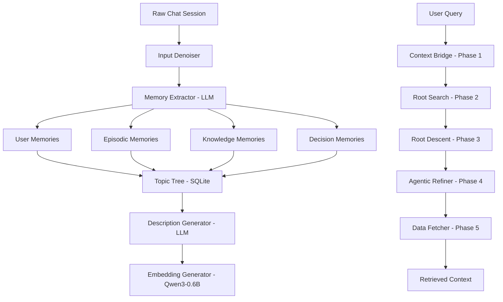

# MindCache — Persistent Long-Term Memory System for AI Chatbots

## Project Overview

MindCache is a **long-term memory system** designed to give AI chatbots the ability to remember, organize, and retrieve information from past conversations. Unlike standard chatbots that lose context after each session, MindCache extracts structured memories from conversations, organizes them into a hierarchical topic tree, and retrieves relevant context when needed — enabling truly personalized, context-aware AI interactions.

The system processes raw chat sessions (user prompts + AI responses), extracts four types of memories, stores them in a semantically organized topic tree, and retrieves the most relevant memories using a multi-phase hybrid search pipeline.

---

## System Architecture

---

## Core Components

### 1. Ingestion Pipeline

#### Input Denoiser (`Memory_extract/input_denoiser.py`)
A **tri-state text router** that classifies input text into CODE, LOG, or TEXT segments using regex-based signal detection. It then applies specialized compression:
- **Code Compressor**: A state-machine skeletonizer that preserves function signatures, class definitions, imports, and comments while stripping implementation body logic. Handles multi-line signatures, decorators, and global constants.
- **Log Compressor**: Stitches multi-line stack traces into single entries, applies fuzzy hashing (masking UUIDs, IPs, hex addresses) to detect structural duplicates, and collapses repeated log patterns with repetition counts.
- **Text**: Passed through unmodified.

This reduces LLM token consumption during extraction while preserving all semantically important information.

#### Memory Extractor (`Memory_extract/memory_extractor.py`)
Uses **Google Gemini** (via `SafeAI` wrapper) with structured JSON output to extract four memory types from each conversation turn:

| Memory Type | What It Captures | Example |
|-------------|------------------|---------|
| **User** | Preferences, profile, experiences | "User prefers quiet hotels near markets" |
| **Episodic** | Events, interactions, narrative context | "User discussed visiting Bandung and exploring Cihampelas Walk" |
| **Knowledge** | Facts, entities, technical details | "Miss Bee Providore is a restaurant in Cihampelas Walk known for Nasi Goreng" |
| **Decision** | Choices made with lifecycle tracking | "User decided to prioritize Cihampelas Walk for shopping" |

Each extraction also generates a **topic chain** (e.g., `["Travel", "Indonesia", "Bandung", "Dining"]`) that determines where the memory is stored in the topic tree.

#### Decision State Analyzer (`Database/decision_analyzer.py`)
An LLM-powered analyzer that manages decision lifecycle. When new decisions are extracted, it examines all decisions under the same topic along with supporting memories (within a ±6 hour time window) to determine status:
- **Active** → Currently in effect
- **Superseded** → Replaced by a newer decision
- **Rejected** → Evidence shows it was abandoned
- **Conditional** → Applies only under specific conditions
- **Inactive** → No longer relevant

---

### 2. Storage Layer

#### Database Schema (`Database/db_setup.py`)
SQLite database with WAL mode for concurrent access:

- **Topic Tree** — Self-referencing hierarchical structure (`parent_id` FK to self). Each node stores: name, level, description, RAPTOR-style summary, and embedding vector (as `LargeBinary`).
- **TriadBlock (Messages)** — Raw conversation turns with provenance tracking (`source_session_id`).
- **4 Memory Tables** — `UserMemory`, `EpisodicMemory`, `KnowledgeMemory`, `DecisionMemory` — all linked to both a Topic node and a TriadBlock via foreign keys. Decisions additionally store `status` and `context`.
- **Memory Registry** — Unified ID space across all memory types.

#### Database Manager (`Database/db_manager.py`)
Handles topic path creation (`_get_or_create_topic_path`), memory storage, embedding blob conversion, and queue-based job management for asynchronous processing.

#### Node Descriptions & Summaries
- **Description Generator** (`nodes_description_only.py`): LLM-generated concise descriptions for each topic node, processing leaves first (from raw memories) then parents (from child descriptions). Used as embedding input for retrieval.
- **Recursive Summarizer** (`Database/nodes_summary.py`): Bottom-up RAPTOR-style summarization — leaf nodes get structured JSON summaries of their memories, parent nodes get aggregated summaries from children.

#### Embedding Pipeline (`embedder.py`)
Uses **Qwen3-Embedding-0.6B** (a 0.6B parameter embedding model) to generate dense vector representations:
- **Root nodes** → Enriched embedding text: root name + description + all descendant names (3 levels deep), ensuring broad categories like "Travel" capture specific sub-topics like "Bandung" in the vector.
- **Non-root nodes** → Standard description-based embeddings.

---

### 3. Retrieval Pipeline

A **5-phase hybrid pipeline** that combines vector search, BM25 keyword matching, and LLM-based reasoning:

#### Phase 1: Context Bridge (`retrieval/context_bridge.py`)
Intelligent query construction with **dual-threshold context merging**:
- Always uses the current prompt
- Includes the previous message (n-1) only if the current prompt is short AND semantically similar (drift detection via cosine similarity)
- Includes n-2 only if the combined text is still short AND n-2 is similar
- Prevents irrelevant history from polluting the query vector

#### Phase 2: Root Search (`retrieval/root_search.py`)
**Hybrid BM25 + Vector** scoring to identify the top-K (default: 5) root domains:
- 60% cosine similarity between query vector and root embedding
- 40% BM25 keyword score on root name + description
- Returns the best matching broad categories (e.g., "Travel", "Technology")

#### Phase 3: Root Descent (`retrieval/root_descent.py`)
Recursive tree traversal within selected roots:
- Computes vector similarity at each level
- Collects all matching nodes (not just leaves)
- Applies **BM25 re-ranking** (60% vector + 40% BM25) across all collected candidates
- Returns top-K (default: 7) candidate topics with scores

#### Phase 4: Agentic Refiner (`retrieval/agentic_refiner.py`)
An **LLM-based refiner** that acts as the final selection layer:
- Receives the ranked candidates with scores (no descriptions — lean input)
- Selects 1-3 most relevant topics
- Decides **retrieval depth** for each: `"summary"` (high-level overview) or `"leaf"` (raw memories)
- Uses constrained decoding via Pydantic schema validation

#### Phase 5: Active Path Data Fetch (`retrieval/active_path.py`)
Fetches actual data from the database:
- **Leaf depth** → Raw memories from all 4 tables, with decision filtering (only active/conditional decisions)
- **Summary depth** → Pre-built RAPTOR summary or node description

---

### 4. Pipeline Orchestration

#### Run Pipeline (`run_pipeline.py`)
Orchestrates the full processing pipeline with API key rotation for Gemini rate limit management. Runs ingestion and reorganization phases sequentially, cycling through available API keys.

#### Background Scheduler (`Database/background_scheduler.py`)
Runs compute-heavy maintenance tasks (embedding updates, cycle repair) sequentially with configurable cooldown periods.

---

### 5. Evaluation Framework

#### Manual Evaluation (`eval/eval_manual_check.py`)
A conflict-aware grading tool for the LongMemEval-M benchmark:
- **Extraction pre-check** — Verifies evidence sessions were captured in the DB
- **Provenance tracking** — Traces each retrieved memory back to its source session, classifying as: ✅ Evidence (correct), ⚠️ Base (haystack noise), or ⚠️ Injected (from another question)
- **Manual grading** — Pass / Fail / Conflict / Skip per question
- **Structured reporting** — JSON + Markdown reports with per-question-type scoring

---

## Key Technical Innovations

1. **Tri-State Input Denoiser** — Reduces LLM token costs by compressing code and logs while preserving semantic content
2. **4-Type Memory Taxonomy** — Separates user preferences, episodic events, factual knowledge, and decisions with lifecycle management
3. **Conceptual Topic Tree** — Memories organized by semantic context (Travel → Bandung → Dining), not just structural taxonomy, enabling contextual retrieval
4. **Decision Lifecycle Management** — LLM-powered state analyzer that tracks decisions through active, superseded, rejected, conditional, and inactive states
5. **Hybrid Retrieval Pipeline** — Combines vector similarity (semantic), BM25 (keyword), and LLM reasoning (agentic) across 5 phases for accurate long-term memory retrieval
6. **Enriched Root Embeddings** — Root nodes embed descendant names to prevent broad-category routing failures
7. **RAPTOR-style Hierarchical Summarization** — Bottom-up recursive summaries enable both overview and detailed retrieval depths

---

## Technology Stack

| Component | Technology |
|-----------|-----------|
| Language | Python 3.11 |
| Database | SQLite with WAL mode |
| ORM | SQLAlchemy |
| LLM | Google Gemini (via `google-genai` SDK) |
| Embedding Model | Qwen/Qwen3-Embedding-0.6B (via `sentence-transformers`) |
| Validation | Pydantic v2 (structured LLM output) |
| Evaluation | LongMemEval-M benchmark |
